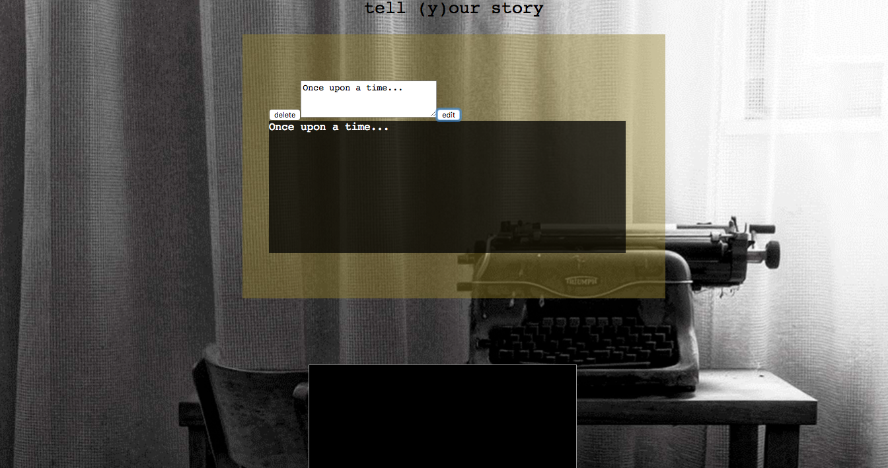

 #Project 2
 ##(y)Our Story

 ;

 Be part of a world-wide story. Add a 'chapter' to the website 
 and have your story continued by someone else, or you can continue someone else's
 story. There are delete and edit buttons for each chapter.

The end and beginning of the story are all decided by the users, and it is all anonymous.

 ; 

To make this app I used React, JSX, and CSS on Sublime Text Editor. I also 
used flexbox to style the components. 

##Code Snippet 
>editChapter(chapterId, text) {
>   axios.put(`https://project2-a12a5.firebaseio.com/story/${chapterId}/title/.json`, [text])
>    .then(()=>{
>    this.getStory();
>    })
>  }

##Build Strategy

I used Trello and a wireframe to buid this app. I stared with the addChapter function that takes the text from the textarea
and renders it on the page. Then I did the delete button, then the edit. Then I worked on separating them into their own 
components. Then I styled it all.

##Complications
If I had more time I would make the editing button more dynamic. It the editable input area would appear onclick,
and then submit the data and disappear onClick again. 

#Aspirations
If I could I would make a login, so that only the original writer of the chapter could delete or edit their chapter.
